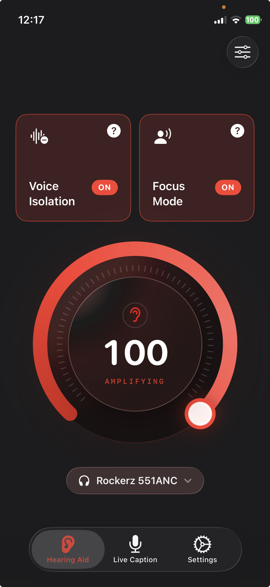

I build Clarive and iScribe, two of the apps below. I've tried to be straight about where each one wins and where it doesn't, and this article argues that an app is probably not your best option at all.

Search for apps for hearing loss and you'll get a dozen ranked lists. Nearly all of them make the same mistake: they put a captioning app, a sound amplifier, and a hearing aid remote control in one list and number them one through ten, as if you're meant to pick a winner.

Those three things don't compete. They solve different problems. Picking from the wrong category is how someone ends up downloading three apps, finding none of them helps, and deciding the whole idea doesn't work.

## Three kinds of app, and which one you actually need

Here's the split. Find yourself in it before you install anything.

**Captioning apps** turn speech into text on your screen. You read instead of listen. These help when you can tell someone is talking but can't separate the words. That pattern has a cause: [age-related hearing loss](https://www.nidcd.nih.gov/health/age-related-hearing-loss) usually takes the high frequencies first, and high frequencies are where the consonants live. Vowels carry the volume, consonants carry the meaning. Apple's own Live Captions, Google's Live Transcribe, Otter, and Ava all live here. So does iScribe, which I also build.

**Amplifier apps** use your phone's microphone to pick up sound, make it louder, and play it into your headphones. These help when speech is clear enough but too quiet, or when the person you want to hear is across a table in a room with other noise. Clarive is one of these. So is Apple's Live Listen, which is built into your iPhone already.

**Companion apps** are made by hearing aid manufacturers to control hearing aids you already own. myPhonak, Oticon Companion, ReSound Smart. If you don't wear that brand's hearing aids, the app does nothing for you.

The test is what fails first. Can you hear that someone is speaking but not make out the words? That's a clarity problem, and captions attack it directly.

Is everything just too faint? That's volume, and an amplifier is the right category.

And if you already wear hearing aids that need adjusting for a specific room, that's the companion app. It's the easiest of the three to overlook and the most powerful of the three to use.

For the wider picture of where phones sit among all the hardware options, we've written about [assistive listening devices](/blog/assistive-listening-device/) separately, and the [comparisons hub](/blog/topics/comparisons/) collects everything in this cluster.

## Before you install anything, the honest order

I make an app in this category, and I still think it's the third-best answer.

If you can afford hearing aids, get hearing aids. They're fitted to the specific shape of your hearing loss, they run all day, and nothing on your phone matches that. Every app on every list, including mine, is working around not having them.

If hearing aids are out of reach, look at cheaper hardware next. Over-the-counter devices have come down a lot in price since the FDA opened that category, and a dedicated device you wear beats a phone in your pocket.

Apps come third. They're worth trying because they cost almost nothing and you can test them tonight, which is a genuine advantage when you're not yet sure whether amplification even helps you. That's the honest case for them: cheap diagnosis of what kind of help you need, not a substitute for the help itself.

And if any of this is new, or if the change came on suddenly, see an audiologist before you spend time on apps. Sudden hearing loss is treated as a medical emergency by the [NIDCD](https://www.nidcd.nih.gov/health/sudden-deafness), and the window for treatment is measured in days.

## Captioning apps: what they do well and where they fall over

Captions are the strongest option in the category, and it isn't close. Speech recognition got good enough that reading a live transcript of a meeting is genuinely workable.

Where they fall over is conversation. Reading has a lag, and by the time you've read the sentence, the room has moved on. That's fine in a lecture where you're receiving rather than replying. In a four-person dinner it means you're always slightly behind, and the moment to say something has passed by the time you know what was said.

The other limit is noise. Recognition degrades when several people talk at once, which is exactly the restaurant scenario that sends people looking in the first place. Test one in the room you actually struggle in, not in your kitchen.

One thing worth checking before you commit: whether the app runs recognition on your phone or sends audio to a server. On-device is faster, works without a connection, and doesn't put your conversations on someone else's computer. Server-based tends to be more accurate on hard audio. Both are legitimate. Just know which one you've installed.

My own two apps both run on-device, so that isn't what separates them. What separates them is whether you want to hear better or read better. Clarive amplifies sound and captions it, in 40+ languages. iScribe doesn't amplify at all: it captions, in 100+ languages, and afterward it can pull out the key points and decisions from what was said.

So a lecture in a language Clarive doesn't cover, or a meeting you need a summary of, points one way. A dinner where you mainly need the person opposite to be louder points the other.

Want specific captioning apps compared side by side rather than sorted into categories? I've written a [ranked list of iPhone apps for hearing loss](https://livetranscribe.pro/best-apps-for-hearing-loss/) on my other site. The same disclosure applies there.

## Amplifier apps: getting the microphone closer

An amplifier app does something simpler than it sounds like. Your phone's microphone picks up the room, the app raises the volume and shapes the sound a bit, and it plays the result into your headphones with as little delay as possible.

The reason it helps is distance, not volume. Put the phone on the table between you and whoever you're talking to, and the microphone is two feet from their mouth instead of six feet away like your ears are. That change in distance does more than the volume slider does.

The reason it fails is also distance. Across a lecture hall, your phone's microphone hears the room, not the speaker, and no amount of amplification fixes that. Personal amplifiers are a close-range tool. That's a property of the category, not a flaw in any particular app.

Apple's [Live Listen](https://support.apple.com/en-us/HT203990) is already on your iPhone and does this for free. It's worth trying first for exactly that reason. The catch is that Apple restricts it to AirPods, Beats, and certified hearing devices, so if you own ordinary Bluetooth headphones it won't work for you. We wrote about [that restriction and the ways around it](/blog/live-listen-without-airpods/) in more detail.

## Companion apps for hearing aids you already own

If you wear hearing aids and haven't installed the manufacturer's app, do that before reading further. It's free, and it does more than anything else on this page.

These apps let you change programs, shift the balance between speech and background noise, and often steer the microphones toward whoever's in front of you. That's your fitted hardware being retuned for the room you're standing in, which is a different order of help from anything a phone microphone can do.

They also tend to be poorly reviewed and confusing, which is why people skip them. Worth pushing through.

Apple's own [Hearing Aid feature](/blog/apple-hearing-aid-feature/) on AirPods Pro sits in an odd spot between categories: it's Apple hardware running a software hearing aid, tuned by a test you take on the earbuds themselves.

## What "free" means in this category

Almost every list you'll read calls these apps free. Nearly none of them checks what happens on day three.

Free usually means one of three things. A daily cap, so you get a set number of sessions and then wait until tomorrow. A session limit, so it stops after some minutes. Or a feature gate, where the app runs but saving, or extra languages, or the sound controls sit behind a subscription.

None of that is dishonest, and running speech recognition costs real money. But it changes whether an app is something you can rely on in a meeting, and no roundup I've read tells you which limit you're signing up for. Install, then find the limit before you need it.

Clarive works this way too. The free tier gives you five uses a day, and beyond that it's a paid plan. I'd rather say that here than have you find out at the wrong moment.

## Where Clarive fits, and where it doesn't

Clarive is a sound amplification app with live captions, and it sits in the amplifier category above.

The one thing it does that Apple's Live Listen doesn't is work with **any** headphones that connect to your iPhone. Wired EarPods, cheap Bluetooth earbuds, over-ear headphones you already own. No AirPods, no certified hearing device, nothing extra to buy. That's the entire reason it exists.

It also does captions in 40+ languages using Apple's on-device speech recognition, with automatic language detection, and it can save a transcript to read later. Everything runs on the phone. No audio leaves it, and there's no account to create.

Where it loses:

- **No hearing test.** It doesn't measure your hearing or tune itself to you. Apple's Hearing Aid feature on AirPods Pro does, and if you own those earbuds, that personalization is worth more than anything Clarive offers.
- **iPhone only, iOS 26 or later.** No Android, no iPad.
- **Five uses a day free**, then a paid plan ranging from $4.99 to $29.99 depending on billing period.
- **No phone calls.** It works on the microphone hearing the room, not on the call audio path.
- **It won't help a moderate or severe loss much.** If conversation is hard across most of your day, this is not the answer and I'd rather you spent the money on an appointment.

If you already wear hearing aids that work, you probably don't need this. If you own AirPods Pro, try Apple's Hearing Aid feature first. It's free and it's tuned to you.

[Try Clarive on the App Store](https://apps.apple.com/us/app/listening-device-clarive/id6748903280) if the amplifier category sounds like the right one and you don't own AirPods.
